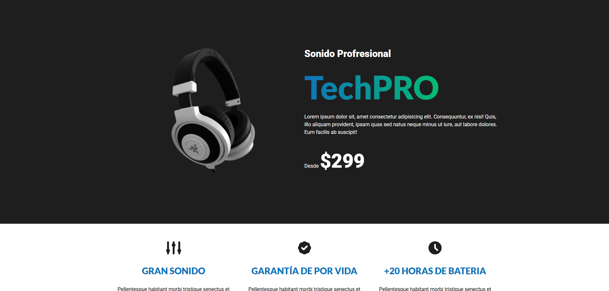

# 🚀 TechPRO

> Sitio web para Audifonos (TechPRO) - Proyecto de curso Udemy.

---

## 🔗 Enlaces Importantes
- **Demo en vivo:** [Ver Proyecto](https://techpro-tienda-audifonos.netlify.app/)
- **Curso de Udemy:** [Link a Udemy](https://www.udemy.com/share/101uW43@SWP1cnJBVUulK_2Ag0RvSFblytu99Wqvfrntgad6UEn6dojaLTJfCZ1mIzOUoHAdeg==/)

## 📸 Vista Previa

## 🛠️ Tecnologías y Herramientas
- **HTML5:** Estructura semántica.
- **CSS3:** Layouts con Flexbox/Grid y variables (Custom Properties).
- **JS:** Script para soporte de imagenes Webp y Avif dentro de propiedades de CSS ([Gist del Script](https://gist.github.com/codigoconjuan/3bbdf0f2920cd9c65187128dd1c032cc)).
- **Metodología (Módulos):** Para un acceso rápido y organizado de etiquetas y clases HTML.

## 📄 Fuentes utilizadas
Tipografías personalizadas obtenidas desde Google Fonts:
- **Fuente principal:** [Roboto](https://fonts.google.com/specimen/Roboto)
- **Fuente secundaria:** [Lato](https://fonts.google.com/specimen/Lato?query=lato&preview.script=Latn)

## ✨ Características (Features)
- [x] **Diseño Responsive:** Adaptado para móviles, tablets y escritorio.
- [x] **Accesibilidad:** Uso de etiquetas semánticas y atributos ALT en imágenes.
- [x] **Versionamiento:** Uso de Git como sistema de control de versiones, siguiendo metodologías como **GitWorkFlow** y **ConventionalCommits**.
- [x] **Performance:** Manejo de diversos formatos de imágenes como webp, avif y jpg, así como adaptabilidad ante diversos navegadores y dispositivos.

## 📝 Lo que aprendí en este proyecto
En este proyecto puse en práctica conocimientos básicos sobre la construcción de sitios web a través de HTML y CSS, tal y como es el uso de Grid y Flexbox, Media Queries, variables en CSS, así como etiquetas semánticas en HTML. 

## 👤 Autor
- **[Toothed20]** - *Estudiante de Ingeniería en Sistemas Computacionales*
- [GitHub](https://github.com/Toothed20)

---
*Este proyecto fue desarrollado con fines educativos y forma parte de mi proceso de aprendizaje continuo en desarrollo web.*